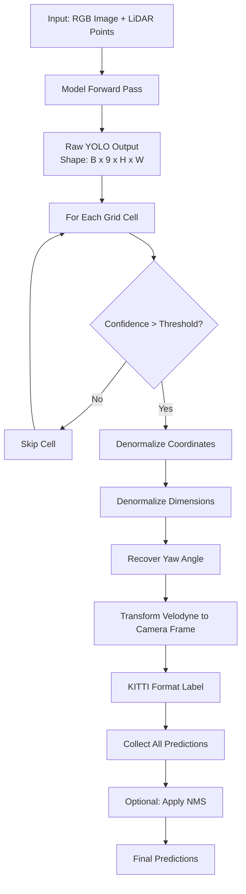
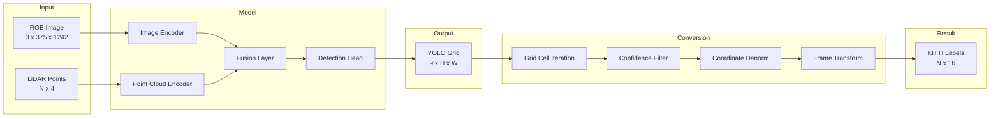

# Inference Quick Reference Guide

A concise reference for predicting labels from model outputs during inference.

## TL;DR - The Essential Steps

```python
# 1. Load model and criterion
model = RgbLidarFusion(args).to(args.device)
model.load_state_dict(checkpoint['state_dict'])
model.eval()

criterion = YoloLoss(args, args.pc_range, args.pc_voxel_size, 
                    args.yolo_num_box_per_cell, args.yolo_box_length, 
                    args.yolo_anchors)

# 2. Run inference
with torch.no_grad():
    outputs = model(images, lidars)  # Shape: (B, 9, H, W)

# 3. Convert to labels
for i in range(outputs.shape[0]):
    predictions = criterion.convert_yolo_output_to_kitti_labels(
        outputs[i], calibs[i], conf_th=0.5
    )
```

## Pipeline Flowchart



## Data Flow Diagram



## Output Format Comparison

### YOLO Format (Model Output)
```
Grid Cell [y, x] contains 9 values:
[conf, x_offset, y_offset, z, h, w, l, yaw_r, yaw_i]
     ↓
All normalized/relative values
```

### KITTI Format (Final Output)
```
Each detection has 16 values:
[class, trunc, occ, alpha, bbox_2d(4), h, w, l, x, y, z, yaw, conf]
     ↓
Real-world coordinates in camera frame
```

## Key Functions Reference

| Function | Location | Purpose |
|----------|----------|---------|
| `model(images, lidars)` | [`model/model.py`](../model/model.py) | Forward pass, returns YOLO output |
| `convert_yolo_output_to_kitti_labels()` | [`model/loss.py:213`](../model/loss.py:213) | Main conversion function |
| `normalize_yolo_labels()` | [`model/loss.py:154`](../model/loss.py:154) | Normalize coordinates (training) |
| `convert_label_kitti_to_yolo()` | [`model/loss.py:178`](../model/loss.py:178) | KITTI to YOLO (training) |

## Critical Parameters

| Parameter | Default | Impact |
|-----------|---------|--------|
| `inference_conf_threshold` | 0.5 | Lower = more detections, more false positives |
| `NMS_overlap_threshold` | 0.5 | Lower = fewer overlapping boxes |
| `pc_range` | [0, -60, -3, 120, 60, 1] | Defines detection volume |
| `yolo_anchors` | [1.56, 1.6, 3.9] | Expected object size (h, w, l) |

## Common Issues & Solutions

| Issue | Cause | Solution |
|-------|-------|----------|
| No predictions | Threshold too high | Lower `inference_conf_threshold` to 0.2-0.3 |
| Too many duplicates | No NMS | Apply NMS with threshold 0.3-0.5 |
| Wrong coordinates | Missing calibration | Ensure `calib` is passed correctly |
| CUDA OOM | Batch too large | Reduce `batch_size` to 1 |

## Coordinate Systems

### Velodyne (LiDAR) Frame
```
    Z (up)
    |
    |_____ X (forward)
   /
  Y (left)
```

### Camera Rectified Frame
```
  Z (forward)
 /
/_____ X (right)
|
Y (down)
```

**Transformation**: Done automatically by `calib.project_velo_to_rect()`

## Code Snippets

### Minimal Inference Loop
```python
model.eval()
with torch.no_grad():
    for batch_data in test_loader:
        images = batch_data['image'].to(device)
        lidars = batch_data['lidar']
        calibs = batch_data['calib']
        
        outputs = model(images, lidars)
        
        for i in range(outputs.shape[0]):
            preds = criterion.convert_yolo_output_to_kitti_labels(
                outputs[i], calibs[i], conf_th=0.5
            )
```

### Save Predictions
```python
def save_kitti_format(predictions, filepath):
    if predictions is None:
        open(filepath, 'w').close()
        return
    
    with open(filepath, 'w') as f:
        for pred in predictions:
            line = f"Car 0 0 -10 0 0 0 0 "
            line += f"{pred[8]:.2f} {pred[9]:.2f} {pred[10]:.2f} "
            line += f"{pred[11]:.2f} {pred[12]:.2f} {pred[13]:.2f} "
            line += f"{pred[14]:.2f} {pred[15]:.4f}\n"
            f.write(line)
```

### Apply NMS
```python
def simple_nms(predictions, iou_threshold=0.5):
    if predictions is None or len(predictions) == 0:
        return predictions
    
    # Sort by confidence
    indices = torch.argsort(predictions[:, 15], descending=True)
    predictions = predictions[indices]
    
    keep = []
    while len(predictions) > 0:
        keep.append(predictions[0])
        if len(predictions) == 1:
            break
        
        # Calculate IoU and filter
        ious = calculate_iou_3d(predictions[0:1], predictions[1:])
        predictions = predictions[1:][ious < iou_threshold]
    
    return torch.stack(keep)
```

## Performance Benchmarks

Typical inference times on RTX 4060:

| Batch Size | Time per Batch | Throughput |
|------------|----------------|------------|
| 1 | ~50ms | 20 samples/sec |
| 2 | ~80ms | 25 samples/sec |
| 4 | ~140ms | 28 samples/sec |

## Validation Example

From [`trainer/trainer.py:val_epoch()`](../trainer/trainer.py:99):

```python
for batch_idx, batch_data in enumerate(val_loader):
    images = batch_data['image'].to(device)
    labels = batch_data['label']
    lidars = batch_data['lidar']
    calibs = batch_data['calib']
    
    outputs = model(images, lidars)
    
    for example_idx in range(outputs.shape[0]):
        output = outputs[example_idx]
        target = labels[example_idx]
        calib = calibs[example_idx]
        
        # Convert predictions
        output_kitti = criterion.convert_yolo_output_to_kitti_labels(
            output, calib, conf_th=0.0  # Use 0.0 for validation
        )
        
        # Calculate mAP
        val_map = calc_map(output_kitti_list, target_list, iou_threshold)
```

## Debugging Checklist

- [ ] Model loaded successfully?
- [ ] Model in eval mode? (`model.eval()`)
- [ ] Gradients disabled? (`with torch.no_grad()`)
- [ ] Correct input shapes?
  - Images: `(B, 3, H, W)`
  - LiDAR: List of `(N, 4)` tensors
- [ ] Calibration objects passed correctly?
- [ ] Confidence threshold reasonable? (0.2-0.7)
- [ ] Output shape correct? `(B, 9, H, W)`

## Quick Command Reference

```bash
# Basic inference
python inference.py --checkpoint_path results/checkpoint_epoch40.pth

# Lower confidence threshold
python inference.py --inference_conf_threshold 0.3

# Save predictions
python inference.py --save_predictions True --output_dir results/predictions

# Use CPU
python inference.py --device cpu

# Smaller batch for memory
python inference.py --batch_size 1
```

## Related Documentation

- **Detailed Guide**: [INFERENCE_LABEL_PREDICTION.md](INFERENCE_LABEL_PREDICTION.md)
- **Code Example**: [INFERENCE_CODE_EXAMPLE.md](INFERENCE_CODE_EXAMPLE.md)
- **Model Architecture**: [`model/model.py`](../model/model.py)
- **Loss Functions**: [`model/loss.py`](../model/loss.py)

## Mathematical Formulas

### Coordinate Denormalization

**X coordinate:**
```
x_real = x_norm × cell_width + x_offset + cell_x_idx × cell_width
```

**Y coordinate:**
```
y_real = y_norm × cell_height + y_offset + cell_y_idx × cell_height
```

**Z coordinate:**
```
z_real = z_norm × z_range + z_offset
```

### Dimension Denormalization

```
h_real = h_norm × anchor_h + anchor_h
w_real = w_norm × anchor_w + anchor_w
l_real = l_norm × anchor_l + anchor_l
```

### Yaw Angle Recovery

```
yaw = atan2(yaw_i, yaw_r)
```

Where `yaw_r = cos(yaw)` and `yaw_i = sin(yaw)`

## Grid Cell Calculation

Given:
- Point cloud range: `[x_min, y_min, z_min, x_max, y_max, z_max]`
- Voxel size: `[vx, vy, vz]`
- Output grid size: `[H, W]`

Cell dimensions:
```
cell_width = (x_max - x_min) / W
cell_height = (y_max - y_min) / H
```

Grid cell for point `(x, y)`:
```
cell_x = floor((x - x_min) / cell_width)
cell_y = floor((y - y_min) / cell_height)
```

## Confidence Score Interpretation

| Range | Meaning | Action |
|-------|---------|--------|
| 0.9-1.0 | Very confident | Trust detection |
| 0.7-0.9 | Confident | Likely correct |
| 0.5-0.7 | Moderate | Review carefully |
| 0.3-0.5 | Low | Many false positives |
| 0.0-0.3 | Very low | Mostly noise |

## Memory Usage

Approximate GPU memory usage:

| Component | Memory |
|-----------|--------|
| Model | ~500 MB |
| Batch (size=2) | ~800 MB |
| Activations | ~400 MB |
| **Total** | **~1.7 GB** |

For 8GB GPU: Can use batch size up to 8-10

## Next Steps After Inference

1. **Visualize**: Use KITTI visualization tools
2. **Evaluate**: Calculate mAP against ground truth
3. **Analyze**: Identify failure cases
4. **Optimize**: Tune thresholds based on results
5. **Deploy**: Integrate into application

## Support

For issues or questions:
1. Check the detailed guides
2. Review the code examples
3. Examine the trainer validation code
4. Debug with lower confidence thresholds