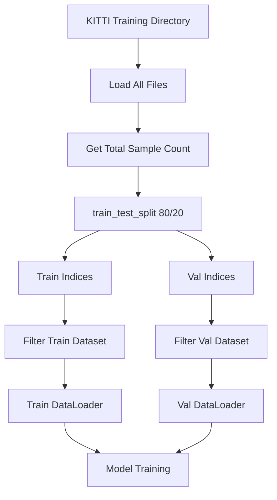

# Train/Validation Split Implementation Plan

## Objective
Modify [`data_loader.py`](16824_RGB_LIDAR_Fusion/data_loader/data_loader.py) to split KITTI object training data into training and validation sets using `train_test_split` with an 80/20 ratio.

## Current Implementation Analysis

### Current State
- **Lines 24-25 in [`main.py`](16824_RGB_LIDAR_Fusion/main.py:24-25)**: Both `train_dir` and `val_dir` point to the same directory (`/mnt/fastDisk/kitti3d/kitti_object/training`)
- **Lines 151-152 in [`data_loader.py`](16824_RGB_LIDAR_Fusion/data_loader/data_loader.py:151-152)**: Creates separate datasets from `args.train_dir` and `args.val_dir`
- **Line 68 in [`data_loader.py`](16824_RGB_LIDAR_Fusion/data_loader/data_loader.py:68)**: Hardcoded to use "training" split
- **Lines 75-97**: Loads all files from the data directory without any filtering

### Problem
Currently, both train and validation datasets load the **same data** from the training directory, leading to data leakage and invalid validation metrics.

## Proposed Solution

### Approach
Use `sklearn.model_selection.train_test_split` to split the dataset indices with an 80/20 ratio, then filter the dataset based on these indices.

### Implementation Steps

#### 1. Modify `KittiDataset` Class
**Location**: [`data_loader.py`](16824_RGB_LIDAR_Fusion/data_loader/data_loader.py:55-141)

Add an `indices` parameter to `__init__()` to filter which samples to include:

```python
def __init__(self, args, data_path: str, transform: transforms.Compose = None,
             training: bool = True, indices: list = None):
```

After loading all file lists (lines 75-97), filter them based on provided indices:

```python
if indices is not None:
    self.image_files = [self.image_files[i] for i in indices]
    self.label_files = [self.label_files[i] for i in indices]
    self.velodyne_files = [self.velodyne_files[i] for i in indices]
    self.calibration_files = [self.calibration_files[i] for i in indices]
    self.len = len(indices)
```

#### 2. Update `get_data_loaders()` Function
**Location**: [`data_loader.py`](16824_RGB_LIDAR_Fusion/data_loader/data_loader.py:144-170)

Replace the current implementation with:

```python
def get_data_loaders(args) -> tuple[DataLoader, DataLoader]:
    from sklearn.model_selection import train_test_split
    
    train_tf, val_tf = get_transforms(args)
    
    # Use train_dir as the source for both train and val
    data_path = args.train_dir
    
    # Create a temporary dataset to get total number of samples
    temp_dataset = KittiDataset(args, data_path, train_tf, training=True)
    total_samples = len(temp_dataset)
    
    # Split indices 80/20
    all_indices = list(range(total_samples))
    train_indices, val_indices = train_test_split(
        all_indices, 
        test_size=0.2, 
        random_state=42,  # For reproducibility
        shuffle=True
    )
    
    # Create datasets with filtered indices
    train_dataset = KittiDataset(args, data_path, train_tf, training=True, indices=train_indices)
    val_dataset = KittiDataset(args, data_path, val_tf, training=False, indices=val_indices)
    
    print(f"Train samples: {len(train_dataset)}, Val samples: {len(val_dataset)}")
    
    # Create data loaders (rest remains the same)
    ...
```

#### 3. Optional: Update `main.py`
**Location**: [`main.py`](16824_RGB_LIDAR_Fusion/main.py:24-25)

Since we only need one data directory now, we could simplify to:
```python
parser.add_argument('--data_dir', type=str, default="/mnt/fastDisk/kitti3d/kitti_object/training")
```

However, this is **optional** - the current setup will work fine since both point to the same directory.

## Key Benefits

1. **No Data Leakage**: Train and validation sets are completely separate
2. **Reproducible**: Using `random_state=42` ensures consistent splits across runs
3. **Proper Alignment**: All file types (images, labels, velodyne, calib) remain synchronized
4. **Standard Practice**: Uses sklearn's `train_test_split`, a well-tested industry standard
5. **Flexible**: Easy to adjust split ratio by changing `test_size` parameter

## Validation Strategy

After implementation, verify:
1. Train and validation sets have no overlapping indices
2. Split ratio is approximately 80/20
3. Total samples = train samples + val samples
4. All file types remain properly aligned
5. Model training shows different train/val metrics (no data leakage)

## Alternative Considered

The existing [`create_split.py`](16824_RGB_LIDAR_Fusion/scripts/create_split.py:1-17) script creates text files with indices, but integrating `train_test_split` directly into the dataloader is:
- More maintainable (no external files to manage)
- More flexible (can easily change split ratio)
- More standard (follows common PyTorch patterns)

## Mermaid Diagram: Data Flow



## Implementation Order

1. ✅ Analyze current implementation
2. ⏳ Add import for `train_test_split`
3. ⏳ Modify `KittiDataset.__init__()` to accept indices parameter
4. ⏳ Update `get_data_loaders()` to perform the split
5. ⏳ Test the implementation
6. ⏳ Verify no data leakage

## Notes

- The split happens at the **index level**, not by copying files
- Memory efficient: only loads files for the respective split
- Maintains compatibility with existing training pipeline
- No changes needed to model, trainer, or loss functions